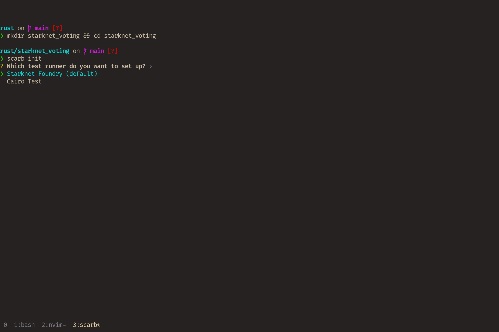
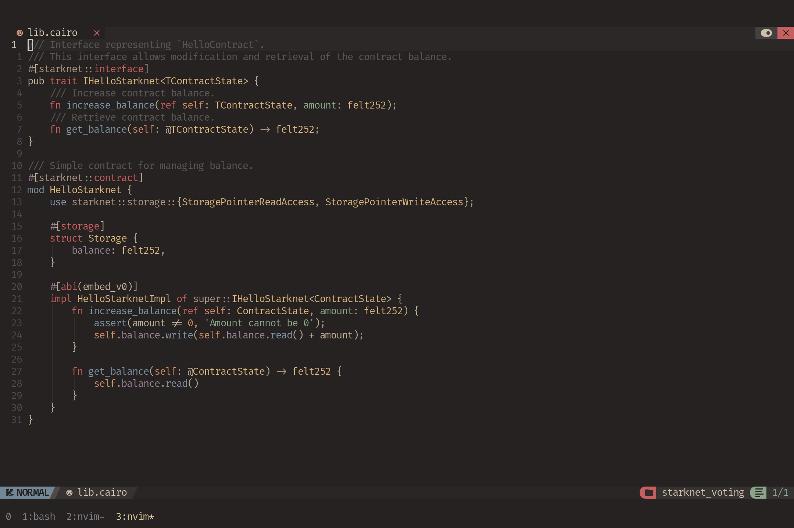
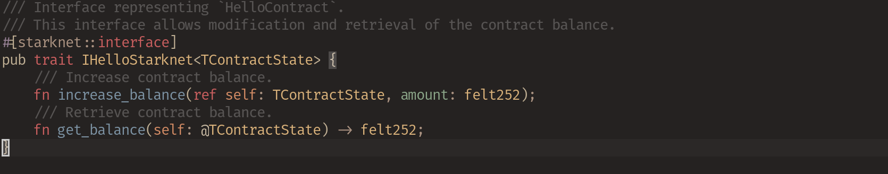
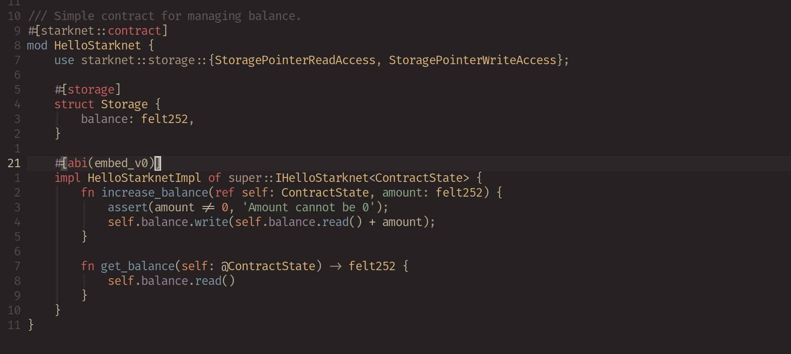

# What are we building you may ask?


As stated before in Module1, We are building a voting system called VoteChain (You can call it whatever you want really). This will have the functionalities of both the creating proposals, requesting for voting stake tokens and also vote for people.

Let us create our own project, Run this command so create a project:

```
mkdir starknet_voting && cd starknet_voting
scarb init
```
This should pop up on your terminal: 



This will create your cairo project for you. Then we can make use of our favorite code editor. For VSCode users, there should be an extension to install to make use of the syntax highlighting and autocompletion.

But for my Neovim Chads


You may have to find a way to setup your lspconfig. Be the chad you are. 

## Project Structure

Now your project repo tree should be similar to this:

```
.
├── Scarb.lock
├── Scarb.toml
├── snfoundry.toml
├── src
│   └── lib.cairo
└── tests
    └── test_contract.cairo
```
The `src` folder is where the main file is while the `tests` folder is where you will write your tests for the smart contract. Now Cairo is different from other languages where testing is what I believe is the main concept behind Cairo smart contracts. If your tests fails, your smart contract can deploy but the functionalities will be defeated.

## Deep Dive Into Cairo



The `lib.cairo` is our main function where the smart contract lives in. Now looking at this file may be very confusing but not worry, I am here to guide you all the way.

Now the folder is divided into two sections, The interface and the contract section.

 

The interface section is the list of functions for the smart contract to run in the main file. It is exactly like interfaces in other languages like Golang and Rust. The contract section is as the name implies, the main file which the contract is ran on.

### Interface section


This section is a `trait` type which contains only has two functions in them which are 

```
    fn increase_balance(ref self: TContractState, amount: felt252);
    fn get_balance(self: @TContractState) -> felt252;
```

The `increase_balance` takes in two arguments: `ref self: TContractState` and `amount: felt252`. `ref` in Cairo means mutable value which should be known from Rust. Mutable values are values that can be changed in the memory. Cairo makes use of `ref` instead of `mut`. There is also `felt252` which is Cairo default value for string or BigInt values. `felt252` is best used for values with string type and also you want to make use of `u128`.

Now you must have noticed the elephant in the room: `TContractState` and `@TContractState`. These are the types for the storage values which can be accessed all through the contract. The `@` in place of the TContractState are for variables that can not be changed only read. If noticed `ref` is used with only `TContractState` and not `@TContractState` because one indicates that the one with ref can be read and overwritten while the one with `@` can only be read. Also `ref` can only be used without the `@` in the type


I know I know that was a lot to take in. But it will all make sense when we start coding.

### Contract section


As the name implies, This is where the main contract lies, where we can be able to input the functions we had specified on the traits. Having little knowledge on Rust should make you guess what we are doing in this section. We have a `trait` so we should just implement this into our contract to be able to make use of the section.

For my Typescript developers, It is like creating a interface and say that a particular class implememts the functions called in that interface. Makes more sense?.


I believe I have spoke too much. Lets just dive into the coding.
